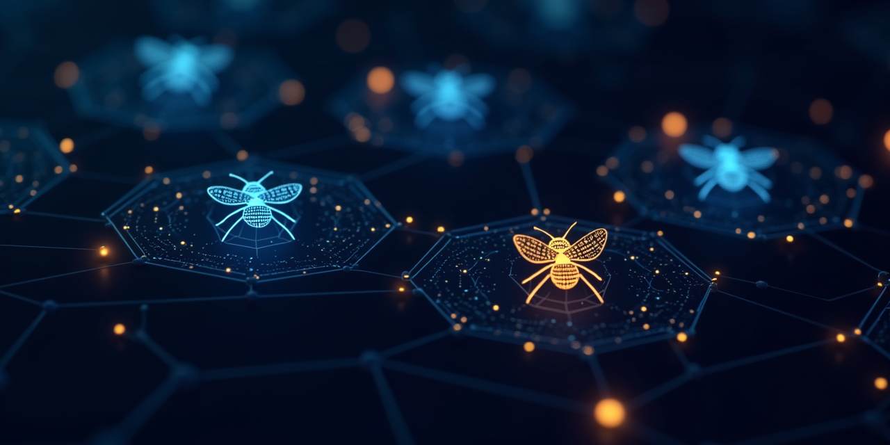

<p align="center">
  
</p>

# 🐝 MESH: Message Envelope for Structured Handoffs

**Reliable inter-agent messaging for [OpenClaw](https://github.com/openclaw/openclaw) fleets.**

MESH adds structured communication between AI agents running on separate hosts. It rides on top of OpenClaw's existing webhook infrastructure with no external message bus required.

**Current version: v3.2**

## Who Is This For?

**You're running more than one OpenClaw agent** and they need to coordinate. Maybe they're on:

- 🖥️ Separate VMs on a LAN
- 🐳 Docker containers on a shared network
- ☁️ Cloud instances across regions
- 🏠 A mix of all of the above

If you just have one agent on one computer, you don't need this. MESH is for when your agents live on different hosts and need to talk to each other, send requests, share results, coordinate work, and not lose messages when something goes down.

**What it's NOT:** This isn't a replacement for OpenClaw's built-in channel system (Signal, Slack, etc.). MESH is agent-to-agent communication, the backchannel your fleet uses to coordinate behind the scenes.

## What Can Agents Do With MESH?

- **Cross-check data:** Two agents independently query the same metric and compare results
- **Collaborative discovery:** Agents brainstorm on data, one finds a pattern, the other validates it, they generate follow-up questions humans didn't think to ask
- **Escalation chains:** A monitoring agent detects an issue, asks a domain expert to investigate, expert shares findings, coordinator decides action
- **Fleet-wide broadcasts:** Push a config change or correction to all agents at once
- **Consensus gathering:** Ask all agents for their opinion on a topic, collect responses, set a verdict
- **Self-healing:** Agent detects a problem, fixes it, notifies the fleet it's back

## Quick Start

### Install

```bash
git clone https://github.com/justfeltlikerunning/openclaw-mesh.git
cd openclaw-mesh
bash install.sh --agent myagent
```

This creates the MESH directory structure with scripts, config, and state files. Add to your `.bashrc`:

```bash
export MESH_HOME="$HOME/openclaw-mesh"
export MESH_AGENT="myagent"
export PATH="$MESH_HOME/bin:$PATH"
```

### Configure Agents

Edit `config/agent-registry.json`:

> **Note:** `hookPath` must include your agent's name (e.g., `/hooks/myagent`). This tells the receiving agent who sent the message. Using just `/hooks` will result in 404 errors.

```json
{
  "version": "2.0",
  "agents": {
    "myagent": {
      "ip": "10.0.0.10",
      "port": 18789,
      "token": "my-hook-token",
      "role": "primary",
      "hookPath": "/hooks/myagent"
    },
    "helper": {
      "ip": "10.0.0.11",
      "port": 18789,
      "token": "helper-hook-token",
      "role": "assistant",
      "hookPath": "/hooks/myagent"
    }
  }
}
```

### Send Messages

```bash
# Send a request (expects a response)
mesh-send.sh helper request "What's the current database status?"

# Send a notification (fire-and-forget)
mesh-send.sh helper notification "Schema updated, please refresh"

# Broadcast to all agents
mesh-send.sh all notification "Fleet-wide maintenance window starting"

# Broadcast to a group
mesh-send.sh @work notification "Domain update: new schema correction"
mesh-send.sh @personal notification "Calendar reminder"

# Rally multiple agents (fan-out request)
mesh-rally.sh "Status report please" --agents "helper,backup"
```

### Receive and Respond

In your agent's hook handler, parse inbound MESH messages:

```bash
source $MESH_HOME/bin/mesh-receive.sh

eval $(parse_mesh "$INCOMING_MESSAGE")
# Now you have: $MESH_FROM, $MESH_TYPE, $MESH_BODY, $MESH_ID, etc.

RESPONSE=$(build_mesh_response "$MESH_ID" "success" "Here's your answer")
send_mesh_response "$MESH_REPLY_URL" "$MESH_REPLY_TOKEN" "$RESPONSE"
```

## Features

### Core Messaging (v1.0)

| Feature | Description |
|---------|-------------|
| Structured envelopes | Every message has sender, recipient, type, correlation ID, timestamps |
| Retry with backoff | 4 attempts with exponential backoff (2s, 4s, 8s) |
| Circuit breakers | Auto-open after 3 failures, 60s cooldown, half-open probe |
| Dead letter queue | Failed messages saved and auto-replayed when agent recovers |
| Alert deduplication | Groups alerts by host and check type, suppresses duplicates |
| Audit logging | Every message logged to `logs/mesh-audit.jsonl` |
| Rich attachments | Files (auto base64 if under 64KB) and URL references |
| Broadcast and rally | Fan-out to all, groups, or selected agents |
| Broadcast groups | Named groups (@work, @personal, @security) for scoped messaging |

### Mesh Resilience (v2.0)

| Feature | Description |
|---------|-------------|
| Peer discovery | Continuous health probing with latency tracking |
| Relay failover | Hub goes down? Another agent auto-promotes |
| Persistent message queue | Store-and-forward with auto-replay |
| Envelope encryption | AES-256-CBC for sensitive payloads |
| HMAC signing | Per-agent cryptographic message authentication |
| Signature verification | Receivers verify signatures on incoming messages |
| TTL enforcement | Expired messages auto-purge and are rejected on receive |
| Replay protection | Nonce and timestamp prevents message replay attacks |
| Fleet status CLI | Terminal dashboard showing peers, latency, queue depth |
| Audit export | JSON/CSV export with filters by agent, type, time range |
| Session tracking | End-to-end traceability from user request through responses |
| Framework support | Standalone Python receiver for CrewAI, AutoGen, LangGraph |
| Collaborative sessions | Persistent multi-agent conversations with shared context |

### Conversation Threading (v3.0)

| Feature | Description |
|---------|-------------|
| Conversations | Group related messages under a shared conversation ID |
| Multi-round rallies | Ask a question, collect responses, ask follow-up, repeat |
| Shared context | Each round carries previous responses so agents see what others said |
| Conversation state | Full history tracked per conversation |
| Conversation lifecycle | Open, active, complete, timeout with status tracking |
| Auto-timeout | Stale conversations auto-close after configurable duration |
| Dashboard threading | Visual threaded view with expand/collapse per conversation |
| Real-time SSE | Server-Sent Events push conversation updates to dashboard live |

### Consensus and Collaboration (v3.1)

| Feature | Description |
|---------|-------------|
| Conversation types | Rally, collab, escalation, broadcast, opinion, brainstorm |
| Consensus | Initiator reviews responses and sets verdict via CLI or API |
| Agent-initiated conversations | Agents can start conversations with each other autonomously |
| Conversation search | Search across all conversations by keyword, agent, type, or status |
| ACK broadcasts | Fire-and-forget with receipt confirmation |

### Real-Time Integration (v3.2)

| Feature | Description |
|---------|-------------|
| Dashboard API | Direct response ingestion endpoint |
| Consensus API | Set verdicts programmatically |
| SSE broadcast | Live push of new conversations, responses, and consensus updates |
| Response correlation | Multiple methods: correlation ID, conversation ID, subject prefix |

## Conversation Types

| Type | Use Case | Example |
|------|----------|---------|
| `rally` | One question to N agents, collect responses | "How many active records in this dataset?" |
| `collab` | Multi-turn investigation between agents | "Let's figure out why these numbers don't match" |
| `escalation` | Issue flows up a trust hierarchy | Monitor agent to domain expert to coordinator |
| `broadcast` | One-way notification to all or subset | "New correction: use key X not key Y for joins" |
| `opinion` | Gather perspectives on a question | "What's the biggest risk in the fleet right now?" |
| `brainstorm` | Open-ended exploration | "What anomalies could we detect from this data?" |

### Rally Example

```bash
# Ask two agents a question and collect their answers
mesh-rally.sh "Count active records in the target dataset" \
  --agents "agent-a,agent-b"

# Both agents independently query the data
# Responses arrive via MESH, correlated to the conversation
# Dashboard shows them threaded under the original question
```

### Agent-Initiated Conversations

Agents can start conversations with each other without human involvement:

```bash
# Agent A starts an opinion request to Agent B
mesh-converse.sh opinion agent-b "I found an anomaly in the data. \
  Can you cross-reference against your dataset?"
```

### Consensus

After collecting responses, the initiator sets a verdict:

```bash
# Review responses, then set consensus
mesh-consensus-set.sh conv_abc123 "confirmed" \
  "Both agents agree: data is consistent."

# Or via API
curl -X POST http://coordinator:8880/api/mesh/consensus \
  -H "Content-Type: application/json" \
  -d '{"conversationId":"conv_abc123","verdict":"confirmed","summary":"Both agree"}'
```

## Architecture

```
┌──────────┐    MESH envelope     ┌──────────┐
│  Agent A  │ ──────────────────> │  Agent B  │
│           │    HTTP POST to     │           │
│ mesh-send │    /hooks/<sender>  │ parse_mesh│
│           │ <────────────────── │           │
│           │    MESH response    │ send_resp │
└──────────┘    via replyTo URL   └──────────┘

Envelope (v3):
{
  "protocol": "mesh/3.0",
  "id": "msg_<uuid>",
  "conversationId": "conv_<id>",
  "from": "agentA",
  "to": "agentB",
  "type": "request",
  "timestamp": "...",
  "replyTo": { "url": "http://...", "token": "..." },
  "payload": {
    "subject": "Status check",
    "body": "What's your current status?"
  },
  "signature": "<hmac-sha256>"
}
```

### Session Routing (replyContext)

MESH supports automatic routing of responses back to the originating conversation (e.g., a specific Slack thread):

1. Sender includes `replyContext` with routing metadata
2. Receiver echoes `replyContext` back untouched when responding
3. OpenClaw delivers the response directly to the originating session or thread

**Requirements:**
- Sender's OpenClaw config: `hooks.allowRequestSessionKey: true`
- Only the generic `/hooks/agent` endpoint reads session keys from POST body

## Broadcast Groups

Define named groups in `agent-registry.json` to scope broadcasts by domain:

```json
{
  "groups": {
    "work": ["agent-a", "agent-b", "agent-c"],
    "personal": ["agent-d", "agent-e"],
    "security": ["agent-f"],
    "all": ["agent-a", "agent-b", "agent-c", "agent-d", "agent-e", "agent-f"]
  }
}
```

Then use `@group` syntax:

```bash
mesh-send.sh @work notification "New data correction deployed"
mesh-send.sh @personal notification "Calendar reminder for tomorrow"
mesh-send.sh @security notification "Vulnerability scan results"
mesh-send.sh all notification "Fleet-wide: maintenance window"
```

Groups are extensible. Add new agents to the appropriate group as your fleet grows. Agents not in a group won't receive messages sent to that group.

## Alert Deduplication

```bash
# Returns: new | suppressed | escalate | recovery
result=$(mesh-dedup.sh "Service agent-b:8900 is down" --host agent-b --check http_probe)

case "$result" in
  new)        echo "First alert: notify human" ;;
  suppressed) echo "Duplicate within 30min: skip" ;;
  escalate)   echo "3+ occurrences: escalate" ;;
  recovery)   echo "Was down, now up: send recovery notice" ;;
esac
```

## Peer Discovery

```bash
mesh-discover.sh probe     # Probe all peers, update health
mesh-discover.sh status    # Show peer health table
mesh-discover.sh routes    # Show routing table
mesh-discover.sh elect     # Run relay election
```

Agents probe all known peers on a schedule and update a routing table. If the hub goes down, the fastest reachable peer auto-promotes to relay.

## Conversation Management

```bash
# Search conversations
mesh-conv-search.sh --type rally --status complete --agent agent-a

# Get conversation context for follow-up messages
mesh-conv-context.py conv_abc123

# Update conversation status
mesh-conv-update.sh conv_abc123 --status complete

# Auto-timeout stale conversations (run via cron)
mesh-conversation.sh timeout

# Set consensus on a conversation
mesh-consensus-set.sh conv_abc123 "confirmed" "Summary of findings"
```

## Fleet Status

```bash
mesh-status.sh    # Terminal dashboard: peers, latency, circuits, queue
mesh-export.sh --format csv --since "2 days ago" --agent agent-a
```

## File Structure

```
openclaw-mesh/
├── bin/
│   ├── mesh-send.sh              # Send messages (retry, circuit breaker, signing)
│   ├── mesh-rally.sh             # Fan-out to multiple agents
│   ├── mesh-receive.sh           # Parse inbound messages + signature verification
│   ├── mesh-reply.sh             # Build and send responses
│   ├── mesh-dedup.sh             # Alert deduplication
│   ├── mesh-queue.sh             # Persistent message queue
│   ├── mesh-discover.sh          # Peer discovery, health probing, relay election
│   ├── mesh-keygen.sh            # Generate HMAC signing keys
│   ├── mesh-track.sh             # Track message delivery status
│   ├── mesh-join.sh              # Add peers with one command
│   ├── mesh-status.sh            # Fleet health terminal dashboard
│   ├── mesh-export.sh            # Export audit logs
│   ├── mesh-crypt.sh             # AES-256-CBC envelope encryption
│   ├── mesh-session-router.sh    # Session-aware routing
│   ├── mesh-conversation.sh      # Conversation lifecycle management
│   ├── mesh-converse.sh          # Agent-initiated conversations
│   ├── mesh-collab.sh            # Multi-turn collaborative sessions
│   ├── mesh-consensus.sh         # Consensus gathering
│   ├── mesh-consensus-set.sh     # Set consensus verdict
│   ├── mesh-conv-search.sh       # Search conversations
│   ├── mesh-conv-update.sh       # Update conversation state
│   ├── mesh-conv-context.py      # Generate context for follow-ups
│   └── mesh-brain-sync.sh        # Sync conversations to knowledge base
├── config/
│   ├── identity                  # This agent's name
│   ├── agent-registry.json       # Fleet agent directory
│   ├── signing-keys/             # HMAC-SHA256 keys
│   └── encryption-keys/          # AES-256 encryption keys
├── state/
│   ├── circuit-breakers.json
│   ├── dead-letters.json
│   ├── queue-state.json
│   ├── routing-table.json
│   ├── peer-health.json
│   ├── active-incidents.json
│   └── conversations/
│       └── conv_<id>.json
├── receivers/
│   ├── generic-receiver.py       # Standalone HTTP endpoint (any framework)
│   └── handler-example.sh
└── logs/
    ├── mesh-audit.jsonl
    ├── queue-replay.jsonl
    └── discover.jsonl
```

## Security

MESH security is opt-in per feature. Zero overhead on LAN, full protection when needed.

| Layer | Always On | Description |
|-------|-----------|-------------|
| Bearer tokens | Yes | Every HTTP request includes authorization header |
| HMAC signing | Opt-in | SHA256 signature on full envelope, prevents spoofing |
| Replay protection | With signing | Nonce and timestamp rejects replayed messages |
| Envelope encryption | Opt-in | AES-256-CBC for sensitive payloads |
| TTL enforcement | Opt-in | Expired messages rejected and purged from queues |

### Recommended Security by Deployment

| Deployment | Setup |
|-----------|-------|
| LAN | Tokens only (default) |
| Cloud (same provider) | Tokens + TLS via reverse proxy |
| Cloud (cross-provider) | Tokens + TLS + HMAC signing |
| Zero-trust | All of the above + VPN between hosts |

### Key Management

```bash
mesh-keygen.sh agent-b          # Generate key for an agent pair
mesh-keygen.sh --all             # Generate keys for all agents
mesh-keygen.sh --status          # Show signing status for fleet
```

Keys stored in `config/signing-keys/` (gitignored). Each agent pair shares one symmetric key.

> **Note:** If agents use symlinks to MESH scripts, the resolved `MESH_HOME` may differ between outgoing sends and inbound receives. Copy signing keys to both locations or set `MESH_HOME` explicitly.

## Framework Integration

### OpenClaw (default)

1. Configure webhook hooks in each agent's `openclaw.json`
2. Add the MESH response protocol to each agent's `AGENTS.md`
3. Deploy MESH toolkit to each host via `install.sh`

### Other Frameworks (CrewAI, AutoGen, LangGraph, etc.)

MESH includes a standalone Python receiver:

```bash
MESH_AGENT=myagent python3 receivers/generic-receiver.py --port 8900
```

Two modes:
- **Inbox mode:** Messages queue in memory. Your framework polls `GET /inbox`
- **Handler mode:** Set `MESH_HANDLER=./my-script.sh` to auto-process each message

```python
# Polling example for any Python-based agent framework
import requests
messages = requests.get("http://localhost:8900/inbox").json()["messages"]
for msg in messages:
    task = msg["payload"]["body"]
    # Feed to your agent framework...
```

## Deployment Topologies

### Multi-VM Fleet

```
┌──────────────────── LAN ────────────────────┐
│                                              │
│  ┌─────────┐ ┌─────────┐ ┌─────────┐       │
│  │ Agent A  │ │ Agent B  │ │ Agent C  │ ...  │
│  │ :18789   │ │ :18789   │ │ :18789   │      │
│  └────┬─────┘ └────┬─────┘ └────┬─────┘      │
│       └─────────────┴─────────────┘           │
│              MESH over HTTP                   │
└──────────────────────────────────────────────┘
```

### Docker Compose

```yaml
services:
  agent-alpha:
    image: openclaw/openclaw
    networks: [mesh-net]
    volumes:
      - ./mesh:/home/agent/.mesh
networks:
  mesh-net:
    driver: bridge
```

### Single Host (Multiple Ports)

Run multiple OpenClaw instances on one machine with different ports. Use `127.0.0.1` with different ports in `agent-registry.json`.

## Recommended Cron Jobs

```cron
# Auto-timeout stale conversations (every 15 min)
*/15 * * * * MESH_HOME=... mesh-conversation.sh timeout

# Peer health probes (every 5 min)
*/5 * * * * MESH_HOME=... mesh-discover.sh probe

# Queue drain check (every minute)
* * * * * MESH_HOME=... mesh-queue.sh drain --auto
```

> **Cron note:** MESH scripts auto-detect `MESH_HOME` from their file location. In cron, set `MESH_HOME` and `MESH_AGENT` explicitly.

## Requirements

| Package | Required | Install |
|---------|----------|---------|
| `bash` 4.0+ | Yes | Pre-installed |
| `jq` | Yes | `apt install jq` |
| `curl` | Yes | Pre-installed |
| `openssl` | For signing | Usually pre-installed |
| `python3` | For conversations | Usually pre-installed |

No Node.js, no Python frameworks, no compiled binaries. Pure bash + jq + curl.

## License

MIT

## Credits

Built by a fleet of agents that got tired of dropping each other's messages. 🐝

## Related Projects

- **[agent-mesh](https://github.com/justfeltlikerunning/agent-mesh)** — Framework-agnostic version. Works with CrewAI, LangGraph, AutoGen, LlamaIndex, and any agent framework.
- **[openclaw-pulse](https://github.com/justfeltlikerunning/openclaw-pulse)** — Real-time WebSocket hub for sub-millisecond agent communication.
- **[agent-pulse](https://github.com/justfeltlikerunning/agent-pulse)** — Framework-agnostic version of openclaw-pulse.
- **[PulseNet](https://github.com/justfeltlikerunning/pulsenet)** — Multi-agent chat interface with pipeline dispatch.
- **[OpenClaw](https://github.com/openclaw/openclaw)** — AI agent runtime with pulse extension and webhook support.
